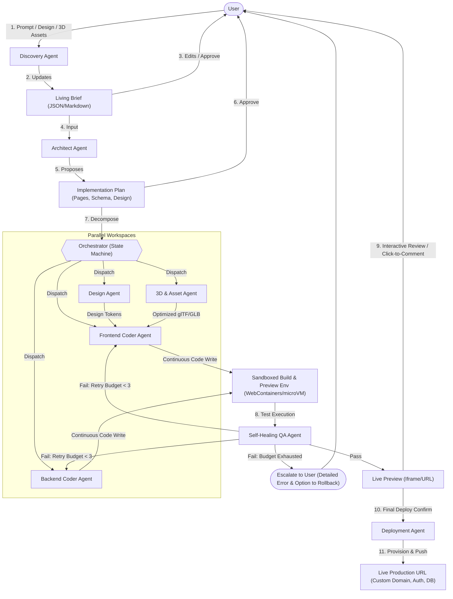

# System Architecture & Agent Design Doc
**Atelier** — Multi-Agent Product Studio  
**Version:** 0.1 · Companion to the PRD and UX/Frontend doc

---

## 1. Architectural Philosophy
Atelier is not one model answering one prompt — it's an orchestrated team of specialist agents, each with a narrow job, a shared project memory, and a supervisor that decides what runs in parallel, what needs human approval, and what gets retried. The three ideas this architecture is built around:

1. **Trust through artifacts, not blind autonomy.** Every phase produces a visible, human-readable artifact (Living Brief → Implementation Plan → Task Graph → Walkthrough) that the user can approve, edit, or reject — the same pattern that has become the standard for building user trust in agentic dev tools, adapted for a non-technical audience.
2. **Failure is an internal event to recover from, not an output to hand the user.** Nearly every reliability requirement in the PRD ("doesn't fail") is solved architecturally here, not by hoping the model gets it right first try.
3. **Progressive context disclosure.** Agents don't load your entire project + every tool spec into context on every call — each agent loads only the relevant "skill" (a scoped knowledge package) for its current task, keeping responses fast, cheap, and focused.

---

## 2. High-Level Architecture



---

## 3. Agent Roster

### 3.1 Orchestrator / Supervisor
The state machine that owns the project lifecycle. Responsibilities:
* Routes work between agents based on the current phase.
* Enforces approval checkpoints (plan approval, design-direction approval, pre-deploy review) — modeled on the three-mode autonomy pattern: fully autonomous for well-scoped, low-risk tasks; collaborative (pause at checkpoints) as the default; supervised (approve every step) for destructive or ambiguous actions.
* Tracks a per-project confidence score — if an agent reports low confidence on a step (ambiguous requirement, conflicting design instruction), the Orchestrator escalates to the user rather than letting a downstream agent guess.
* Owns retry budgets and circuit breakers (see §6).

#### 3.1.1 How Work Actually Gets Assigned — the "Brain"
There is no single model "being" Atelier, and no one place you'd point to and say "that's the brain." Intelligence lives in a loop the Orchestrator runs continuously, in partnership with the Architect Agent's planning. For every unit of work:
1. **Classify.** The Architect Agent tags each item in the Implementation Plan with a task type — UI generation, data/schema, 3D content, integration, copy, QA — and it's this tag, not a keyword match on the user's original prompt, that determines which specialist agent picks it up.
2. **Score complexity & risk.** Each task gets a lightweight complexity score (how many files/systems it touches) and a risk flag (does it touch payments, auth, or destructive data operations?). This score decides two things at once: the model tier used for that task (a fast/cheap model for a boilerplate component; a stronger-reasoning model for architecture-critical or genuinely ambiguous work), and the autonomy default (low-risk → runs autonomously; high-risk or ambiguous → pauses at a supervised checkpoint).
3. **Build the dependency graph.** Tasks become nodes in a Directed Acyclic Graph (DAG) — "checkout page" depends on "data model" and "design tokens" and won't be scheduled until both exist, while "3D hero embed" and "auth flow" have no dependency on each other and run in parallel, in separate sandboxed workspaces.
4. **Dispatch.** Each ready node goes to its specialist agent with only the context that task needs (relevant design tokens, relevant schema slice, its own scoped skill package) — never the entire project history, keeping calls fast and focused.
5. **Collect & judge.** When an agent reports back, the Orchestrator checks its self-reported confidence and the QA Agent's independent gate results before marking a node done.
6. **Re-plan on surprise.** If a task surfaces information that invalidates part of the plan (e.g., the data model is missing a field nobody specified), the Orchestrator routes back to the Architect Agent to patch the plan — a coder agent is never allowed to quietly improvise an architecture decision on its own.

### 3.2 Discovery Agent
* **Persona:** Senior product manager conducting an intake interview.
* **Input:** Raw prompt + any attachments (Figma link, screenshots, reference sites).
* **Output:** The Living Brief — a structured document (audience, core flow, must-have vs. nice-to-have, design direction, data/integration needs, 3D/immersive applicability).
* **Technique:** Asks 1–3 questions per turn, using closed (chip-based) questions wherever a small enumerable set of answers exists, and open text only when it doesn't. Terminates when brief completeness crosses a threshold or the user says "build with what you have."

### 3.3 Architect Agent
* Converts the Living Brief into an Implementation Plan: page/route list, data model sketch, third-party integrations needed, chosen design direction, and a first-pass task graph.
* This is the artifact the user explicitly approves before any code is written.
* Responsible for task decomposition: breaking the plan into parallelizable units of work sized for individual coder-agent runs to avoid one agent trying to hold an entire codebase in context at once.

### 3.4 Design Agent
* Owns Design-to-Code (Pillar 2) and the Design Quality Gate (Pillar 5).
* Two ingestion sub-modes: token extraction (Figma REST API — colors, type, spacing, component tree) and vision fallback (screenshot → layout parsing via vision model) for cases without Figma access.
* Runs the brainstorm → self-critique → finalize loop described in the UX/Frontend doc before handing tokens to coder agents — this is a distinct internal step, not folded into code generation, so it can be reviewed/regenerated independently.
* Produces a design-tokens artifact (JSON: colors, type scale, spacing, radius, motion durations) consumed by all coder agents, guaranteeing visual consistency.

### 3.5 3D/Asset Agent
* Owns Pillar 3. Searches Sketchfab's Data API (Creative-Commons-licensed, downloadable models by default), retrieves candidate models with license metadata, and pulls the asset via the Download API.
* **Source-vs-generate decision:** For every 3D content need, the agent first checks Sketchfab. If nothing matches well enough — or the brief is inherently custom — it routes to native generation instead, calling a text-to-3D/image-to-3D API with the brief's description or reference photo.
* **Post-processing pipeline:** Mesh/texture compression (Draco/meshopt), automatic re-centering, scale normalization, and LOD generation for performance budgets.
* **Embed strategy:** `<model-viewer>` for simple viewers, and React Three Fiber scenes for custom camera/interaction behavior.
* **Attribution:** Automatically attaches license/attribution metadata for sourced assets.

### 3.6 Coder Agents (Frontend / Backend, parallelized)
* Works against shared design tokens and data models, avoiding conflicting patterns.
* Runs inside the sandboxed build/preview environment so output is continuously executable.
* Reports structured status (done / blocked / low-confidence) to the Orchestrator.

### 3.7 Self-Healing QA Agent
* Runs on every change: type-check → lint → unit tests → headless browser smoke test → visual-regression diff.
* On failure, reads the error/stack trace and attempts a fix within a retry budget.
* Prevents broken builds from reaching the user.

### 3.8 Deployment Agent
* Provisions hosting, database, and auth; injects environment variables securely; configures custom domains; and performs the production deploy.
* Keeps versioned deployment history for single-click rollbacks.

---

## 4. Sandboxed Build & Preview Environment
Every project gets an isolated, ephemeral execution environment:
* **Client-side path (default):** An in-browser Node runtime (WebContainer-style) for near-zero-latency preview with no server cost.
* **Server-heavy path (fallback):** Isolated microVM sandboxes (e.g., E2B, Firecracker) for server processes, databases, or non-JS runtimes.
* Both paths are isolated per project to ensure security and prevent cross-tenant access.

---

## 5. Memory & State Model
| Store | Contents | Notes |
| :--- | :--- | :--- |
| **Living Brief** | Structured intake answers | Editable by user directly |
| **Implementation Plan** | Pages, data model, integrations, design direction | Versioned; re-approval required on major changes |
| **Design Tokens** | Colors, type, spacing, motion, signature element | Shared read-only by all coder agents |
| **Task Graph** | Node status, dependencies, assigned agent, retry count | Drives the Orchestrator's scheduling |
| **Project Knowledge Base** | Vector embeddings of prior decisions, style preferences | Searchable so preferences persist across sessions |
| **Artifact Log** | Every plan, walkthrough, screenshot, and diff | Full audit trail; enables rollback and versioning |

Each agent loads only the state relevant to its current task, following a progressive-disclosure "skills" pattern.

---

## 6. Reliability & Failure-Handling Design
* **Retry budgets, not infinite loops:** Each task node gets a bounded number of self-heal attempts (default: 3). Exceeding it triggers user escalation with a plain-language block summary.
* **Gates before preview:** Type-checking, linting, and smoke tests run before a change is shown as "done".
* **Circuit breakers:** Repeated failures flag a task as needing human design intervention rather than wasting LLM tokens.
* **Confidence-gated autonomy:** High-risk tasks (schema changes, data deletion, payment integration) default to supervised checkpoints regardless of confidence.
* **Visual regression:** Prevent "technically working, but visually broken" code from passing.
* **Full versioning:** Every artifact and deploy is versioned to allow single-action rollbacks.

---

## 7. Human-in-the-Loop Checkpoints
1. **After Discovery:** Approve the Living Brief.
2. **After Architecture:** Approve the Implementation Plan.
3. **After Design:** Approve or redirect the design tokens/direction before code generation.
4. **Before Deploy:** Review the diff/changelog and confirm.
5. **On Escalation:** When retry budgets are exhausted or agent confidence is low.

---

## 8. Security Model
* Per-project sandbox isolation.
* Secrets/env variables are injected at runtime into the sandbox, never exposed in client logs or LLM context.
* Scoped, short-lived tokens for external APIs (Figma, Sketchfab, hosting).
* Generated auth defaults to secure industry standards (e.g., bcrypt/Argon2, managed auth libraries like Auth.js or Clerk integration).

---

## 9. Data Model (Sketch)
```
Project
 ├─ LivingBrief (1:1)
 ├─ ImplementationPlan (1:1, versioned)
 ├─ DesignTokens (1:1, versioned)
 ├─ TaskGraph (1:many TaskNode)
 │    └─ TaskNode (agent, status, retries, artifacts)
 ├─ Assets (many: sourced 3D models, images, license metadata)
 ├─ Deployments (many, versioned, rollback pointer)
 └─ ArtifactLog (many: plans, walkthroughs, screenshots, diffs)
```
